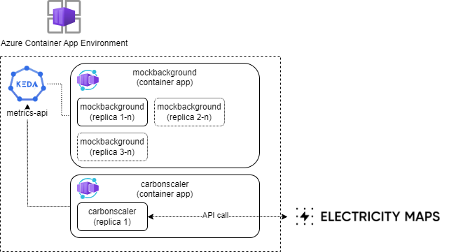

# CarbonScaler

[](https://docs.microsoft.com/en-us/dotnet/csharp/) 
 
 

       ______           __               _____            __          ____  ____  ______
      / ____/___ ______/ /_  ____  ____ / ___/_________ _/ /__  _____/ __ \/ __ \/ ____/
     / /   / __ `/ ___/ __ \/ __ \/ __ \\__ \/ ___/ __ `/ / _ \/ ___/ /_/ / / / / /     
    / /___/ /_/ / /  / /_/ / /_/ / / / /__/ / /__/ /_/ / /  __/ /  / ____/ /_/ / /___   
    \____/\__,_/_/  /_.___/\____/_/ /_/____/\___/\__,_/_/\___/_(_)/_/    \____/\____/   


                     
# Sustainable Scaling for Beginners
Terms like *sustainability, carbon footprint, CO2 neutral, and climate change* are no longer absent from today's debate on environmental protection and the transition to a more sustainable world. That everyone contributes to keeping this planet as livable as possible is a beautiful and noble goal. When you think of CO2 emissions, you might quickly think of steaming factories, heavy trucks, or agriculture, but we in the ICT sector with our data centers also contribute to CO2 emissions. (See, for example, this article in [Science](https://datacenters.lbl.gov/sites/default/files/Masanet_et_al_Science_2020.full_.pdf) or the research by the [International Energy Agency](https://www.iea.org/energy-system/buildings/data-centres-and-data-transmission-networks)). Multiple studies indicate that our sector is responsible for 1 to 2 percent of total emissions. This may sound like a small amount, but if we assume 2% emissions, this is still 736 million tons of CO2 per year. An average person within the EU has an annual emission of 6 to 8 tons of CO2. So 736 million tons is equivalent to the emissions of approximately 100 million people.

## What can you do as an organization?
Reducing these emissions may sound like a drop in the ocean, but every drop counts. In the context of these drops, there are numerous ways in which you as an organization can reduce the energy consumption of your ICT landscape. For example, as an organization, you can consider signing a contract with a data center that has a clear "green" vision regarding renewable energy, cooling facilities, and hardware efficiency. If your organization uses a cloud solution, you can often take advantage of the many features that cloud providers already offer in the field of sustainability. Powerful "ready-made" dashboards can give you direct insight into which parts of your landscape have how much emissions.

In addition to these more hardware-related matters, as an organization, you can also look at more efficient use of energy within your applications. For example, consider minimizing requests (is all the data we send really necessary?), messaging instead of polling (consider using messaging systems like RabbitMQ or Azure Service Bus instead of regular polling, as this can provide more efficient and energy-saving mechanisms), and data retention (is long-term storage of data really necessary?).
 
### The next level
In addition to these obvious matters, there are also more advanced ways to improve the CO2 emissions of your application landscape. A good example of this is the dynamic use of real-time data about the current energy mix. The energy we use is always a mix of different energy sources such as gas, coal, nuclear, wind, and solar. Especially the last two energy sources are, of course, not always available in the same quantities (e.g., no wind and cloudy weather). This means that the energy is "greener" at different times of the day than at other times.

A number of parties offer this real-time data for use within your organization. These include, for example, [ElectricityMaps](https://app.electricitymaps.com/map) en [Watttime](https://watttime.org/docs-dev/coverage-map/)

### Scalability Scenarios
Within many organizations, there are certain services/applications/background processes that are important, but the timing of when they run is less critical. For example, you can think of certain calculations, reports, or data synchronization. By using the real-time data from electricitymap or watttime, you can choose to scale these processes up when the energy mix is green enough for your standards.

By using the autoscaling platform KEDA in combination with the data from electricitymap or watttime, you can ensure that your processes are scaled up automatically.

**To illustrate this setup, the following [git repo](https://github.com/pabes74/CarbonScaler) has been made available.** This repo contains a "proof of concept" of a carbonscaler container. This carbonscaler reads the data from ElectricityMaps and converts it into a score. Based on that score, the MockBackgroundProcess container is scaled up or down. This uses KEDA and Azure Container App (see [this blog](https://www.bergler.nl/container-orchestratie-gemakkelijk-gemaakt-maar-hoe-dan/)). The choice for Azure Container Apps implies that you are bound to using the Azure cloud. Since Azure Container App internally uses Kubernetes, you can also use the KEDA scalers.

> *¹ Microsoft intends to be fully climate neutral by 2025, which raises the question of how useful this will be in Azure after 2025. However, there is a caveat that it is unknown whether this means they will use 100% green energy or also partially compensate for CO-2. Providing 100% green energy based on solar and wind is challenging in the Netherlands.*

Schematically, this Proof of Concept looks as follows:


You can see here that the carbonscaler makes an API call to Electricity Maps to retrieve the recent energy mix.
In the repo, this is included in the ElectricityMapService.cs. This service makes an API call based on the following appsettings:

```json
  "ElectricityMapService": {
    "BaseAddress": "https://api.electricitymap.org/",
    "AuthToken": "##########",
    "CarbonIntensityEndpoint": "v3/carbon-intensity/latest",
    "Zone": "NL"
  }
```
Here you should, of course, use your own AuthToken, which you can request from ElectricityMap. The zone NL is indicated here, but you can adjust this depending on the location of your data center.

The mockbackground container app has the KEDA scaler metrics API configured (see [docs](https://keda.sh/docs/2.15/scalers/metrics-api/)). This looks at the outcomes of the carbonscaler and scales based on the configured target value. 
In the deployment Bicep of your container app, you could include the following to configure the KEDA scaling:
```yaml
      scale: {
        minReplicas: 1
        maxReplicas: 5
        rules: [
          {
            name: 'carbonscaler'
            custom: {
              type: 'metrics-api'
              metadata: {
                format: 'json'
                targetValue: '6'
                unsafeSsl: 'true'
                url: 'https://carbondata***/api/electricitymap'
                valueLocation: 'carbonGrade'
              }
            }
          }
        ]
```
This is sufficient to ensure that the KEDA scaler is active and scales the linked services (in this case, the mockbackground service) based on the targetValue. It also specifies that the scaling has a maximum of 5 replicas and a minimum of 1. KEDA has the capability to scale from 0 to n. Note that the more replicas, the higher the hosting costs.

## Conclusion
This is one of the example measures you can take as an organization to reduce your CO2 footprint. As mentioned earlier, these are small steps, but every beginning counts. With this technology, you can also take measures to scale certain services in other regions. For example, the energy mix in Scandinavia is often much "greener" than in the Netherlands. The effort required to set up such a construction is relatively low, making it worth considering within organizations. Hopefully, this article provides some inspiration to seriously consider more sustainable ways to set up your ICT landscape.
                                                               

## How to Start

#### Local build
```sh
docker build -f Dockerfile -t carbondata:dev .
docker build -f Dockerfile -t mockbackgroundprocess:dev .
```
#### Local run
```sh
docker run -it -p 3084:8080 carbondata:dev
docker run -it -p 3085:8080 mockbackgroundprocess:dev
```

#### Connect to Container registry
```sh
docker login ***.azurecr.io
username: ***
```
password in portal

#### Push local container registry
```
docker tag carbondata:dev ***.azurecr.io/carbondata
docker push ***.azurecr.io/carbondata
docker tag mockbackgroundprocess:dev ***.azurecr.io/mockbackgroundprocess
docker push ***.azurecr.io/mockbackgroundprocess
```

## Test service in cloud
In console van de mockbackgroundprocess

#### Install packages
```
apt-get update
apt-get upgrade
apt install curl
```

#### Test service endpoints
```
curl carbondata/api/ElectricityMap
curl carbondata/api/stub
```
